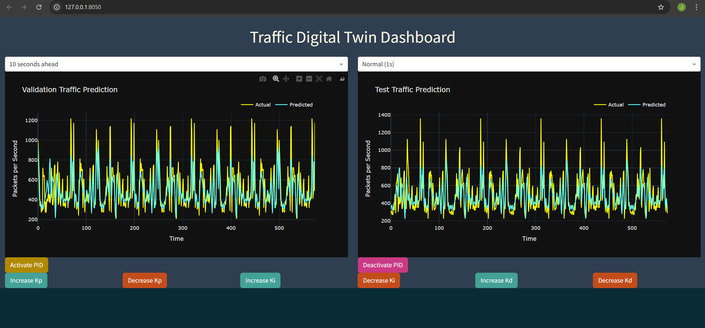
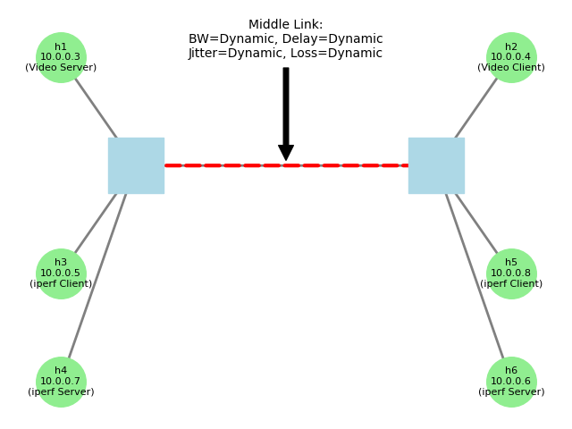

# **Extended-Topology**  

## **Overview**  
The **Extended-Topology and Live Dashboard** provides a real-time visualization of network traffic, offering insights into realistic traffic monitoring and prediction for Digital Twins.  

### **Key Features**  
- 🌐 **Web-Based Interface** – Accessible via a browser.  
- 📊 **Live-Updating Graphs** – Real-time visualization of traffic data.  
- 🔄 **Dynamic Prediction Intervals** – Adapts to traffic patterns.  
- 🎛 **Interactive PID Control** – Fine-tune parameters for improved accuracy.  

### **Prerequisites**  
- VS Code (Recommended)   

### **Running the Dashboard**  
Steps to set up and run the dashboard:  

1. **Importing the pre-trained module** into the directory where the dashboard script is stored [cnn_traffic_model.pth](model/cnn_traffic_model.pth).
2.   **Placing the Scaler** in the same directory as the dashboard script [Scaler](model/scaler.pkl).
3. **Placing the dataset** in the same directory as the dashboard script [data](data/packets_per_sec_analysis.csv)..  
4. **Running the script** to launch the [dashboard](DigitalTwin.py).
5. Below is the dashboard overview.

## **Next step for the extended topology to be built, image below** 

## Progress   
`Topology.py` sets up the topology and runs traffic excahnge while calling the video streaming server inside the `server` folder, as well as the video streaming client inside the `client` folder.  

## Pcap file  
During streaming and Iperf data transmission, pcap files are captured. Various flaws detected in the middle link of the topology are captured and stored in the `pcap` folder.  

## Live Dashboard Upgrade1  
`DigitalTwin_dashboard.py` is an update of the dashboard, where it works efficiently with the activation of the PID. It also enables the continuous activation, deactivation and fine-tunning of the PID over time.

## How to Run the Emulation  
1. **Cleanup**: First we remove existing docker images and containers by running the bash script `./clean.sh`.  
2. **Build server and client docker images**: using the `./build_docker_images.sh` script .  
3. **Build the topology**: Executing the topology script to set up the network.  
4. **Generate Live Traffic & Predictions**:  
   - The generated pcap files can first be preproced using a pcap processing file to generate a csv file which can be applied to the `DigitalTwin_dashboard.py` to generate live traffic and as well to make predictions and also apply our PID technique.
